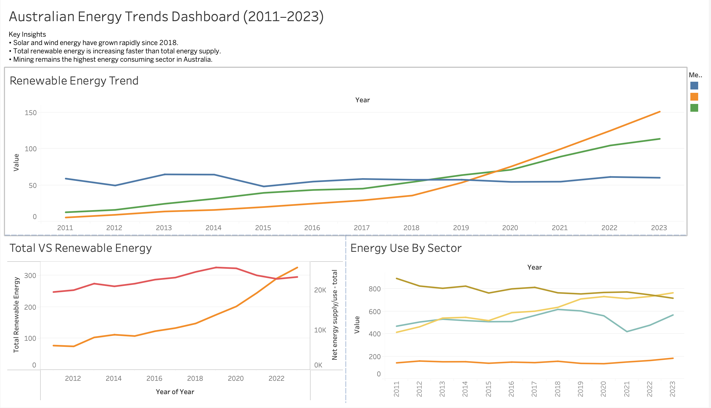

# Australian Energy Trends Dashboard (2011–2023)

This Tableau project analyses Australia's energy production and renewable energy growth trends using data from the Australian Bureau of Statistics.

## Dashboard Insights

• Solar and wind energy increased rapidly after 2018  
• Renewable energy contribution is growing faster than total energy supply  
• Mining remains the largest energy consuming sector  

## Tools & Technologies

- Tableau Desktop
- Data Visualisation
- Time Series Trend Analysis

## Data Source

Australian Bureau of Statistics – Energy Accounts Data

## Dashboard Preview

## File

The Tableau packaged workbook (.twbx) contains the full interactive dashboard.
